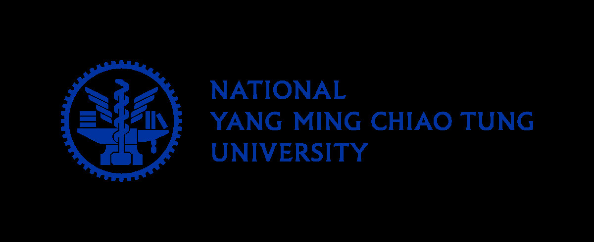

# Digital Systems Design

This is an advanced course on the Introduction to Digital Systems offered by **National Yang Ming Chiao Tung University (NYCU)**. The course **balances theory with practical application**, featuring **16 design examples** across the 4th and 7th chapters. Moving beyond basic digital logic theory, the course develops professional design principles. I utilized the **AMD Xilinx Zedboard FPGA** as the implementation platform, navigating the entire FPGA design flow from writing RTL and performing simulation and debugging with ILA in Vivado, familiarizing myself with the entire FPGA design flow.
 
 
Regarding the theoretical component, the 1st chapter serves as a review of core digital systems concepts while introducing critical real-world design issues such as hazards and timing. Chapters 2 and 8 cover Verilog syntax; despite having a prior foundation, I used this opportunity to refine my coding style to ensure the synthesized hardware accurately reflects the intended logic. Chapter 3 introduces the classification and evolution of Programmable Logic Devices, tracing the path from ROM, PAL, PLA, and CPLD to the FPGA platforms used today. Chapter 5 explores design methodologies beyond standard finite state machines, including state machine charts and microprogramming, concluding with linked state machines to facilitate the design of complex system controllers. Finally, chapter 6 provides an in-depth explanation of internal FPGA architecture and fundamental EDA tool concepts, offering a concrete understanding of how hardware is physically realized.
 
 
The practical core of the course is found in chapters 4 and 7. Chapter 4 provides 12 design examples that progress from simple to complex, covering various combinational and sequential circuit design techniques. In the context of the current AI era, chapter 7 introduces the hardware design of floating-point arithmetic units for addition, subtraction, multiplication, and division, providing insight into how these numerical computations are actually implemented in hardware.
 
 
Completing this course has rounded out my understanding of digital design and laid a robust foundation for future hardware design and system development. When writing RTL, I no longer view it as mere code but can visualize the actual synthesized hardware structures. Simultaneously, I have gained a profound realization of the various digital design theories covered throughout the course.

## Chapters

 Chapters   | Descriptions
--------|:-----
[Ch1][1]|Review of Logic Design Fundamentals
[Ch2][2]|Introduction to Verilog
[Ch3][3]|Introduction to Programmable Logic Devices
[Ch4][4]|Design Examples
[Ch5][5]|State Machine Charts and Microprogramming
[Ch6][6]|Designing with FPGAs
[Ch7][7]|Floating-point Arithmetic
[Ch8][8]|Additional Topics in Verilog

[1]: Ch1/
[2]: Ch2/
[3]: Ch3/
[4]: Ch4/
[5]: Ch5/
[6]: Ch6/
[7]: Ch7/
[8]: Ch8/

